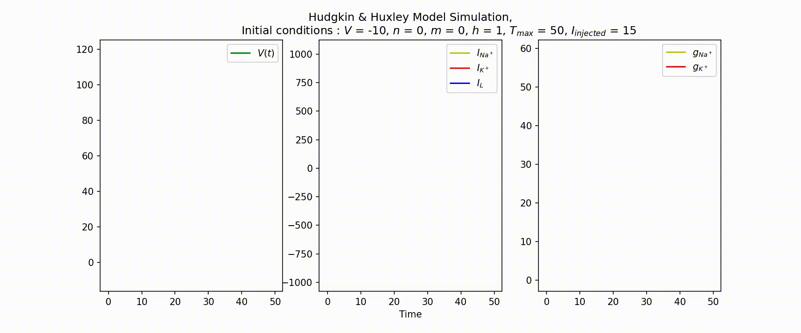
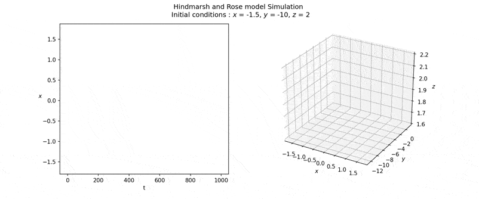

# BioNSim

Currently under construction, for the time being it consists of a collection of Python scripts to implement biological models of neurons using Python. 
Numpy, matplotlib and scipy were used to animate the output. 

## Hudgkin & Huxley Model

### Input
- For each ion, G is the conductance and Eq is the equilibrium potential.
```python
import hudgkin_huxley as hh

cell = hh.Neuron(voltage=np.linspace(-150, 150, 100), 
                 sodium={'G' : 120., 'Eq' : 120.}, 
                 potassium={'G' : 36., 'Eq' : -12.},
                 leak={'G' : 0.3,'Eq' :10.6})

cell.simulate(V_init=-10, n_init=0, m_init=0, h_init=1, Tmax=50, inj = 15)
``` 
### Output


## Hindmarsh & Rose Model
- Model parameters should be specified when instantiating the object, and the initial conditions can be changed when simulating the model.
```python
import hindmarsh_rose as hr

cell = hr.Neuron(r = 0.001, s = 4, xr = -8/5, a = 1, b = 3, c = 1, d = 5, I = 2)

cell.simulate_hind_rose(x_init=-1.5, y_init=-10, z_init=2, Tmax=1000)
``` 
### Output



## Fitzugh & Nagumo Model
```python
import fitzugh-nagumo as fn

cell = fn.Neuron(a=0.7, b=0.8, tau=13)
  
cell.simulate_fitz_nagu(V_init=-2,w_init=-1.5, I_init=0.5, Tmax=100)
```
### Output


## ToDo :
This project is still in developement.

### Doing the animation with matplotlib instead of celluloid and applying it to the scripts (DONE)
### GUI
### Adding more biological models : IKir, Izhikevich model, ......

